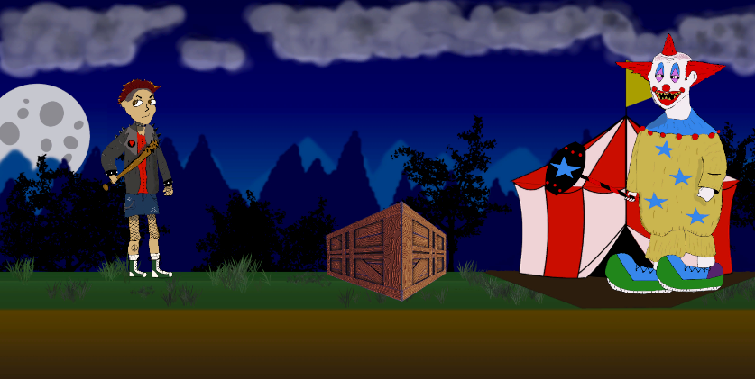
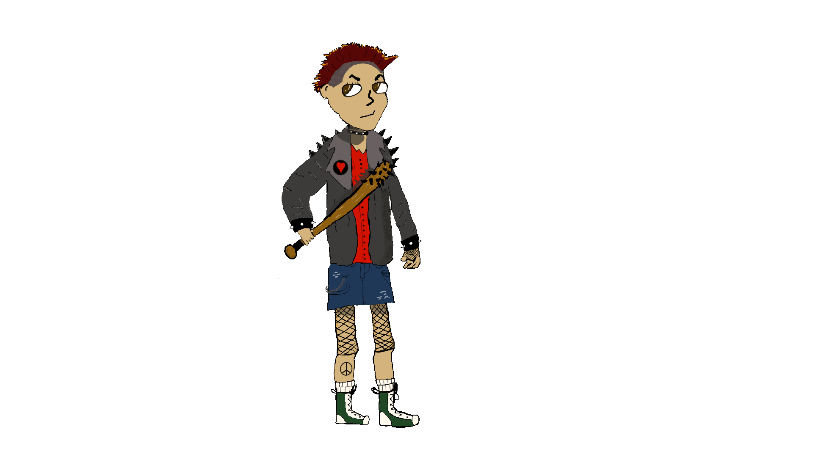
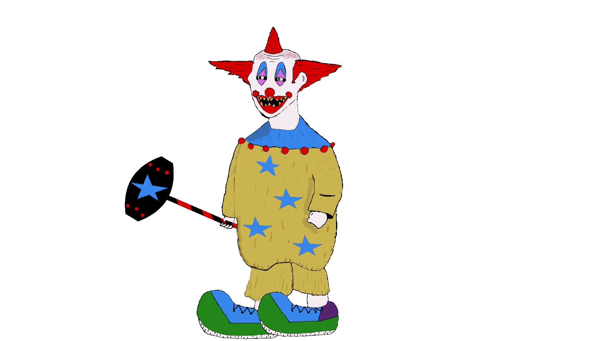

# Killer Clown 2D Game Art
Hand-drawn sprites and Unity implementation for a 2D action platformer.

## Overview
This project contains my custom 2D game art and Unity scenes for a side-scrolling platformer created during Spring 2025.
I designed and animated the main character (MC) and enemy characters (EC), built environments, and implemented them in Unity.

  

## Gallery

## Features
- 🎨 Hand-drawn character sprites and animations (idle, run, attack)
- 🏞️ Custom environment assets (crates, backgrounds)
- ⚙️ Unity animation setup with pivot points & sorting layers
- ✨ Imported and scripted in C# using VS Code

## Tech
- Unity (URP)
- C# (VS Code)
- Clip Studio
  
## License
Code is released under the MIT License.
Art assets © 2025 Carissa Becerra — personal/non-commercial use only.

